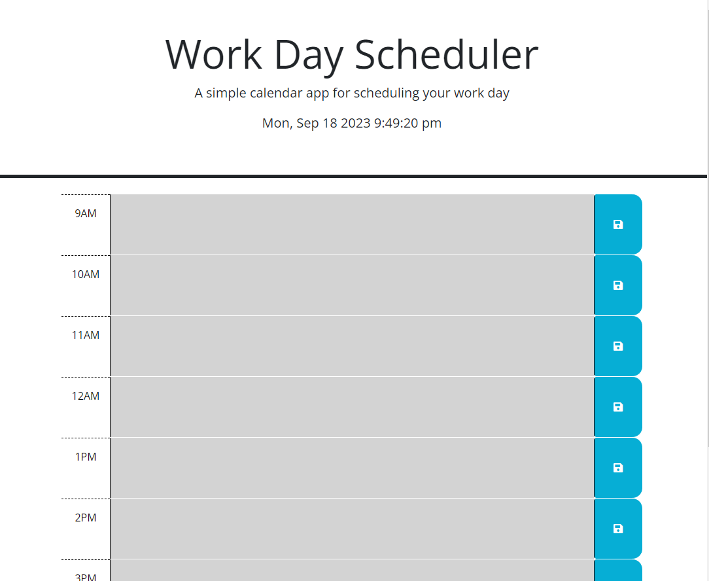
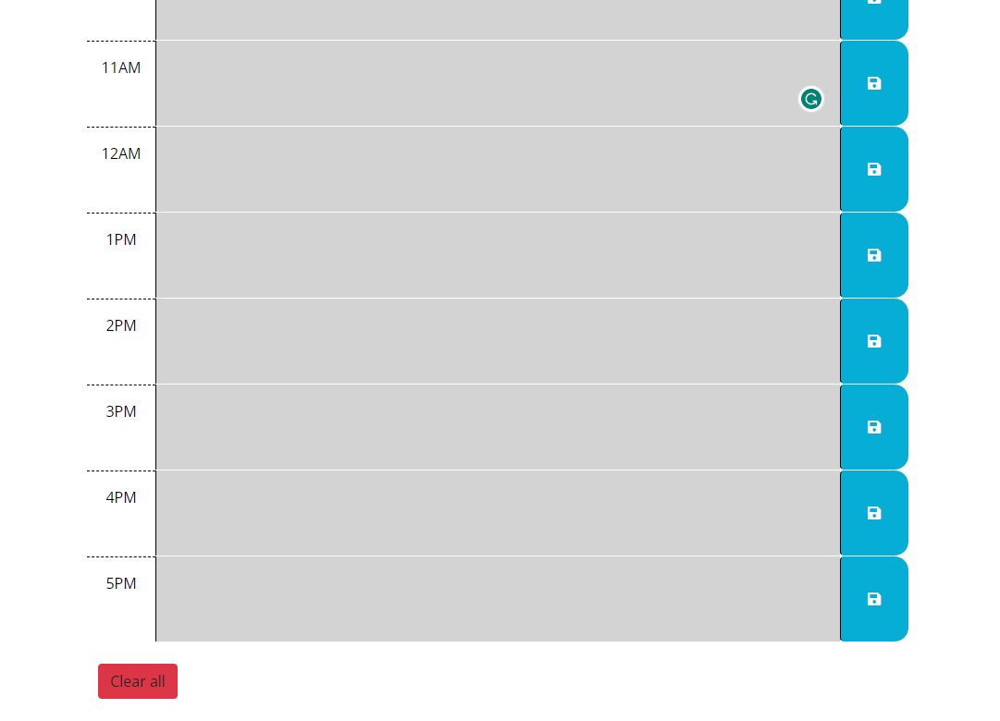

# Work-Day-Scheduler

# About
This is Module 5 Challenge by the Ohio State University bootcamp. This project is about creating a one day schedule for work (9am to 5pm). 

## Description
This website will display the accurate time on the top of the page. Below, users can enter their tasks in the hourly schedule, and they can also save what their entered by clicking the "save" button. The color red will highlight the current time the user is on, and any time before will be greyed out. Green will represent the oncoming time.

## Screenshot of the website

## Link to the website
https://kaarageonigiri.github.io/Work-Day-Scheduler/